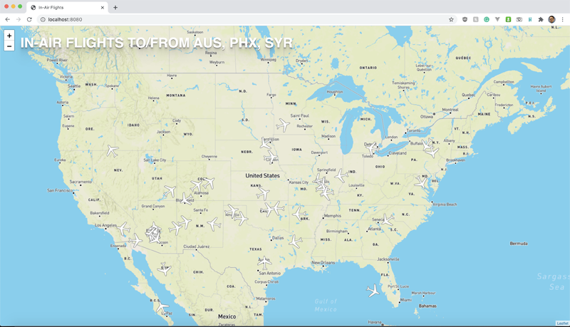

# In-Air Flights

This repository is part of a Thing-a-Week challenge. This week’s theme is:

> Integrate with an API. It can be an API you create yourself, or use an
existing
API (there’s bunches of them out there).

Retrieves details of in-air flights via
[aviationstack.com](https://aviationstack.com) and maps them. Also uses
[mapbox.com](https://mapbox.com) for map tiles.

**Notes:**

Copy `src/config.js.example` to `src/config.js` and add your mapbox.com and
aviationstack.com API keys. Set `useLive` to `true` to present live aviation
data or `false` to present included cached data.

---

